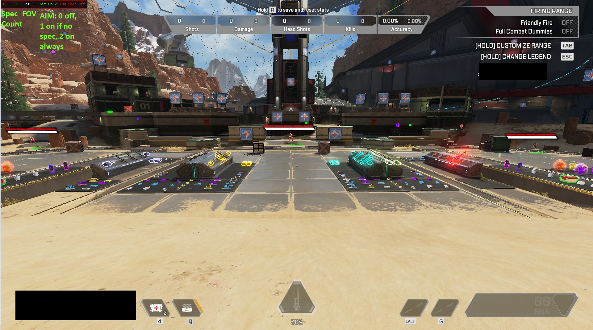

<a name="readme-top"></a>

[![Contributors][contributors-shield]][contributors-url]
[![Forks][forks-shield]][forks-url]
[![Issues][issues-shield]][issues-url]

<br />
<div align="center">

  <h3 align="center">apexsky</h3>

  <p align="center">
    Apex Legends hack
    <br />
    <br />
    <br />
    <a href="https://www.unknowncheats.me/forum/apex-legends/406426-kvm-vmread-apex-esp-aimbot.html">UnknownCheats thread</a>
    ·
    <a href="https://github.com/chettoy/apex_dma_kvm_pub/issues">Report Bug</a>
    ·
    <a href="https://github.com/chettoy/apex_dma_kvm_pub/issues">Request Feature</a>
  </p>
</div>

<br />



<br />

## About The Project

Apex Legends QEMU/KVM/DMA/Linux hack

UnknownCheats thread: <https://www.unknowncheats.me/forum/apex-legends/406426-kvm-vmread-apex-esp-aimbot.html>

Bone IDs reference: <https://www.unknowncheats.me/wiki/Apex_Legends_Bones_and_Hitboxes>

Game version (Steam Only right now): v3.0.62.29

**Please delete the old offsets.ini after updating.**

 **Features**

1. apex_dma_kvm_pub no-overlay features.

    > This is the No Client(Windows) Branch, nothing is needed on the windows side.
    >
    > ESP Glow color picker for knocked and alive, visable or not visable.
    >
    > Item Glow with item filter.
    >
    > Weapon Glow with Weapon filter.
    >
    > Firing Range dummp targeting debug testing.
    >
    > TDM Aimbot/Glow so you only target the other team.
    >
    > Left/Right or both mouse buttons to aim.

2. apex_dma_kvm_pub Client features.

    > ESP Glow color picker for knocked and alive, visable or not visable.
    >
    > Item Glow with item filter.
    >
    > Weapon Glow with Weapon filter.
    >
    > Mini-Map radar*1.
    >
    > Full map radar*2.
    >
    > Firing Range dummp targeting debug testing.
    >
    > TDM Aimbot/Glow so you only target the other team.
    >
    > Custom aiming distance.
    >
    > Left/Right or both mouse buttons to aim.
    >
    > Custom Predition speed and Gravity to use with Headshot Mode*3.
    >
    > Save and Load config buttons and at s

3. apexsky features

    * Inherits all features from apex_dma_kvm_pub.
    * Optional glow box to replace player glow (ideal for screenshot prevention or live broadcasting). (requires overlay enabled)
    * Sky Grenade feature.
    * Improved target locking.
    * Advanced targeting options with various bone selection effects.
    * Calculate and display the game's frame rate.
    * **Aiming Target Indicator:** Aiming Target Indicator feature (requires overlay enabled).
    * **Config File Management:** Config file editing and saving capabilities.
    * **User-Friendly Customization:** Interactive terminal menu with a more intuitive and user-friendly design for customization.
    * Dynamic color changes indicate target armor status.
    * **Favorite Gamer Highlight:** Highlights favorite gamers for quick identification.
    * **Weapon Model Glow:** Adds weapon model glow and spectated indicator.
    * Utilize keyboard backlight to display the number of spectators (requires D-Bus support).
    * **Multilingual Support:** Supports multilingual functionality for global accessibility.
    * **Predictive Auto Trigger:** Includes a feature with predictive capabilities for automatic triggering.
    * **Auto-Loading Offsets:** Automatically loads offsets, making it convenient to keep up with game version updates.
    * **Real-time Team Damage Display:** Shows the total damage dealt by teammates in real-time.

Please star if you like it.
Look forward to your testing and feedback.

## Getting Started

**apexsky_kvm:**

There are really only two steps:

1. Run the game on a windows guest in a kvm virtual machine.
2. Run the compiled apex_dma program on the Linux host.

    ```shell
    sudo ./apex_dma
    ```

Additional information:

1. Please put the overlay window on the top of the VM screen after start. For example, on top of the looking-glass window.
2. For a better experience, please passthrough your keyboard, mouse or controller into the VM.
3. Press Insert to open the Overlay menu. Press and hold the Insert key to temporarily interact with the overlay.
4. If you are using a resolution other than 1080p, save the configuration and then modify the `screen_width` and `screen_height` in *settings.toml* and reload the configuration.

Click on *[Actions](https://github.com/chettoy/apexsky/actions)* to download the auto-built artifacts.

Or compile it yourself.

## Build from source

**Requirements:**

* C++ toolchain
* Rust toolchain
* CMake
* Git

**Install Rust:**

```bash
curl --proto '=https' --tlsv1.2 -sSf https://sh.rustup.rs | sh
```

**Install Build Dependencies (Ubuntu):**

```bash
sudo apt install cmake clang protobuf-compiler libusb-1.0-0-dev libzstd-dev libglfw3-dev libfreetype6-dev libvulkan-dev libxrandr-dev libxinerama-dev libxcursor-dev libxi-dev libxext-dev wayland-protocols libwayland-dev libxkbcommon-dev
```

**Build:**

```shell
git clone --recurse https://github.com/chettoy/apexsky
cd apexsky
git submodule update --init --recursive
cd apex_dma
./build.sh
```

## FAQ

1. Many people are using a single GPU

    > If there is only one GPU and the linux host can't be displayed after  starting the VM, you can still use features other than the overlay in  such a case.
    > You can even turn off the overlay and use it as a no-overlay version.
    > In this case you will not be able to use only the overlay-dependent  features such as the mini-map radar, health shield bars, GUI menus,  spectator display, etc. But all the original features of the no-overlay  branch such as the player glow, text menu in terminal, and the new sky  grenade will still work.

2. It seems that the client is still reading the values required for the esp stuff. If AC is looking for access on those specific memory locations, then IDK if just removing the implementation of the overlay will work in  terms of preventing detection. Or is AC simply detecting the presence of the overlay/client itself, and banning due to that?

    > First of all, everything related to game state is realized by *access on those specific memory locations*. So we need to use DMA or VM techniques to access memory covertly.
    > AC detects the overlay client, so we re-implement the overlay outside the VM and remove the client.

3. I feel the aimbot seem not good as KrackerCo's one

    > We added a few new parameters to aimbot, if you turn auto bone off, turn no-recoil on (it's off by default now) and set the aimbot predict fps to 75, aimbot will run the same as it did before with the same smoothing values.
    > If you want a natural game feel and normal behavior as if you don't use auto-aiming but dramatically increase the hit rate, instead of wanting to lock bullets at a single point, use auto bone and maybe turn off no-recoil.

## Acknowledgments

* [memflow](https://github.com/memflow/memflow)
* [ratatui](https://ratatui.rs)
* [tracel-ai/burn](https://github.com/tracel-ai/burn)
* [TheCruz's Apex Aimbot+ESP](https://www.unknowncheats.me/forum/apex-legends/369786-apex-directx-wallhack-smooth-aimbot-source.html)
* [h33p/vmread](https://github.com/h33p/vmread)
* [Y33Tcoder/EzApexDMAAimbot](https://github.com/Y33Tcoder/EzApexDMAAimbot)
* [MisterY52/apex_dma_kvm_pub](https://github.com/MisterY52/apex_dma_kvm_pub)
* [KrackerCo/apex_dma_kvm_pub](https://github.com/KrackerCo/apex_dma_kvm_pub)
* [CasualX/apexdream](https://github.com/CasualX/apexdream)
* [Nexilist/xap-client](https://github.com/Nexilist/xap-client)
* [Xnieno/ApexDreamForYou](https://github.com/Xnieno/ApexDreamForYou)

<p align="right">(<a href="#readme-top">back to top</a>)</p>

<!-- MARKDOWN LINKS & IMAGES -->
[contributors-shield]: https://img.shields.io/github/contributors/chettoy/apex_dma_kvm_pub.svg?style=for-the-badge
[contributors-url]: https://github.com/chettoy/apex_dma_kvm_pub/graphs/contributors
[forks-shield]: https://img.shields.io/github/forks/chettoy/apex_dma_kvm_pub.svg?style=for-the-badge
[forks-url]: https://github.com/chettoy/apex_dma_kvm_pub/network/members
[issues-shield]: https://img.shields.io/github/issues/chettoy/apex_dma_kvm_pub.svg?style=for-the-badge
[issues-url]: https://github.com/chettoy/apex_dma_kvm_pub/issues
