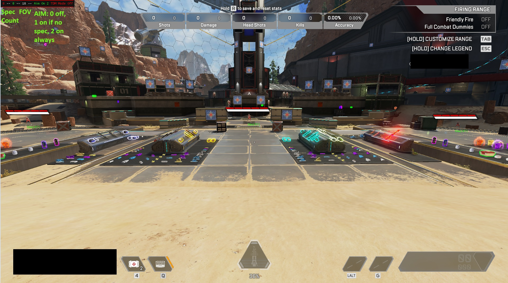

<a name="readme-top"></a>

[![Contributors][contributors-shield]][contributors-url]
[![Forks][forks-shield]][forks-url]
[![Issues][issues-shield]][issues-url]

<br />
<div align="center">

  <h3 align="center">apexsky</h3>

  <p align="center">
    DMA/KVM external game mod
    <br />
    <br />
    <br />
    <a href="https://www.unknowncheats.me/forum/apex-legends/406426-kvm-vmread-apex-esp-aimbot.html">UnknownCheats thread</a>
    ·
    <a href="https://github.com/chettoy/apexsky/issues">Report Bug</a>
    ·
    <a href="https://github.com/chettoy/apexsky/issues">Request Feature</a>
  </p>

</div>

<br />



<br />

## About The Project

External game mod for Apex Legends.

The project is powered by **ohosky**, a universal game mod loader that was born from this project.

It accesses game memory via DMA or virtual machine.


**Features**

* **FPS Display**: Calculate and display the game's frame rate. (overlay required)
* **MODs**: Write JavaScript code and package it into mods to expand the functionality and share with your friends.
* **Safety:** Write memory only when enabling features that require memory modification.
* Supports controlling the mouse via Kmbox, QEMU QMP, etc., at which point aimbot does not need to modify memory (no evidence suggests this is safer).
* **User-Friendly Customization:** Interactive terminal menu with a more intuitive and user-friendly design for customization.
* **Config:** Fine customization achieved through saving and editing settings in settings.toml file.
* **Offsets Loader:** Supports dynamic loading of offsets from offsets.ini file, making it convenient to keep up with game version updates.
* **Multilingual Support:** Supports multilingual functionality for global accessibility.


**Mod Features**

 * Apex Legends v3.0.4.25
   
   UnknownCheats thread: <https://www.unknowncheats.me/forum/apex-legends/406426-kvm-vmread-apex-esp-aimbot.html>
   
   * **Aimbot** with Improved target locking.
   * **Aim Assist:** Simulates powerful aim assist-like magnetism through Aimbot.
   * **Sky Grenade**
   * **Triggerbot** with magnetism and hit prediction.
   * **Auto SuperGlide** via standalone mod
   * **Bone/Skeleton ESP:** Optional glow box and Bone/Skeleton ESP and health bar to replace player glow (ideal for screenshot prevention or live broadcasting). (overlay required)
   * **Aiming Target Indicator:** White small circle indicating current pre-aim target. (overlay required)
   * **Favorite Gamer Highlight:** Highlights favorite gamers for quick identification.
   * **Spectator List:** Displays spectator list. (overlay required)
   * **Weapon Model Glow:** Indicates spectators through weapon model color change.
   * **Keyboard Spectator Indicator: **Alerts the number of spectators by blinking the keyboard backlight (requires D-Bus support).
   * **Teammate Performance Display:** Real-time display of teammates' damage and kills. (overlay required)
   * **Voice Navigator:** Providing in-game callouts like teammates. (overlay required; currently only Chinese voice pack available, more contributions welcome)


**Overlay Features**

| apexsky_overlay                   | 🐧Linux | 🪟Windows | 🌐Web | Shareable to teammates |
| --------------------------------- | ------ | -------- | ---- | ---------------------- |
| player and health bar ESP         | ✅      | ✅        | ✅    | ✅                      |
| mini-map radar                    | ✅      | ✅        | ✅    | ✅                      |
| show player box and skeleton      | ✅      | ✅        | ✅    | 🚧                      |
| show nearby loots and death boxes | ✅      | ✅        | ✅    | 🚧                      |
| aiming target indicator           | ✅      | ✅        | ✅    | ❌                      |
| fps display                       | ✅      | ✅        | ✅    | ❌                      |
| spectator list                    | ✅      | ✅        | ✅    | 🚧                      |
| teammate damage list              | ✅      | ✅        | ✅    | ✅                      |
| voice navigator (callouts)        | ✅      | ✅        | ✅    | 🚧                      |


Please star if you like it.
Look forward to your testing and feedback.


## Getting Started


### Usage


|                        | 🎮Game Device                | 2️⃣econd Device               | note                                              |
| ---------------------- | --------------------------- | --------------------------- | ------------------------------------------------- |
| 🎮🖥💻+DMA+2️⃣🖥💻            | clean✅                      | apexsky_dma+apexsky_overlay |                                                   |
| 2️⃣🐧(Host)+🎮(VM)         | clean✅                      | apexsky_dma+apexsky_overlay | Requires dual GPU                                 |
| 2️⃣🐧(Host, no GPU)+🎮(VM) | clean✅                      | apexsky_dma                 | No overlay                                        |
| 2️⃣🐧(Host, no GPU)+🎮(VM) | apexsky_overlay             | apexsky_dma                 | Overlay can be detected                           |
| 2️⃣🐧(Host, no GPU)+🎮(VM) | apexsky_overlay🌐 in browser | apexsky_dma                 | Difficulty in displaying the graphics on the game |
| 🎮🐧                     | apexsky_dma+apexsky_overlay |                             | Not recommended                                   |


**Play with DMA:**

```shell
./skyrun.exe --load apex1.spk --load apex1_sg.spk
```


**Play with VM:**

There are really only two steps:

1. Run the game on a Windows guest in a KVM virtual machine.

2. Run the compiled mod program on the Linux host.

   * Using Memflow

     ```bash
     sudo ./skyrun --load apex1.spk --load apex1_sg.spk kvm
     ```

   * Using LeechCore

     Find the virtual machine process PID and QMP address after starting the virtual machine, then run the mod program on the Linux host.

     ```shell
     sudo ./skyrun --load apex1.spk --load apex1_sg.spk vmm qemu://hugepage-pid=<PID>,qmp=<QMP_ADDRESS>
     ```

     For example, if your VM's PID is 5678 and the QMP address is /tmp/qmp-win11.sock, the command would be:

     ```shell
     sudo ./skyrun --load apex1.spk --load apex1_sg.spk vmm qemu://hugepage-pid=5678,qmp=/tmp/qmp-win11.sock
     ```

     See details at https://github.com/ufrisk/LeechCore/wiki/Device_QEMU


**Select target game variant:**

Default: game_dx12.exe

To target game.exe (DX11), edit `settings.toml` and set `game_ver_dx11` to true.


**Start menu only:**

```shell
./skyrun --load apex1.spk mod-menu
```


**Overlay (optional):**

ESP is now implemented as a stand-alone program. The official `apexsky_overlay` currently supports Linux/Windows/Web platforms.

You can choose `apexsky_overlay` for any platform or use them both. You can also write your own unofficial overlay program.

* Linux

     ```bash
     apexsky_overlay
     ```

* Windows

  ````shell
  apexsky_overlay.exe
  ````

* Web

  Access via browser at https://chettoy.github.io/apexsky/


> [!NOTE]
> If you are using a resolution other than 1920x1080, save the configuration and then modify the `screen_width` and `screen_height` in settings.toml and reload the configuration.

> [!NOTE]
> The default setting only allows connections from localhost. If remote access is required, you need to expose the ESP service port on the network. The listening address can be viewed and edited in settings.toml.

To use overlay, first ensure that the ESP service is enabled, either by enabling it in the menu or by editing the settings file.

You can then connect overlay running on any platforms to apexsky's ESP service.

~~Press Insert to open the Overlay menu.~~ Press and hold the Insert key to temporarily interact with the overlay.

Click the `Connection` button to display the address bar, and then click again to connect to the ESP service.


### MODs

~~To install mods:~~

1. ~~Create a `mods` folder in `~/.local/share/apexsky/` or in the current directory.~~
2. ~~Place the `.spk` mod package into the `mods` folder.~~
3. ~~Navigate to the mod menu and install mods.~~

A more user-friendly installation method is still under development.


**To make mods:**

Currently, mods can be written in Rust, C++, or JavaScript. To write mods in Python, please raise an issue to discuss support for Python.

Refer to the provided examples for writing mods in different languages:

- Rust: Check the code in this project.
- C++: See `ohosky_sdk/ohosky_api`.
- JavaScript/TypeScript: Refer to `apexsky/mods/apex1_sg`.

The current mod API provides a unified interface for accessing the target process memory and the ability to share data between mods. All mods loaded will run at the same time and will share DMA device connections and caches.


Use `ohosky_mod_packer` to pack mods

```shell
./ohosky_mod_packer path/to/output.spk path/to/mod/manifest.json
```


### Download

1. **Download the mod loader and libraries for accessing memory**

   - **skyrun**: Find the precompiled `skyrun`.

   - **memflow libs**: ~~Ensure the corresponding memflow connector plugin files are in `~/.local/lib/memflow/` or the current directory~~ 

      No need to download memflow libs anymore.

   - **vmm lib**: If using MemProcFS or LeechCore, extract files to `~/.local/lib/memprocfs/` or the current directory:

      - Download and extract the files from [MemProcFS Releases](https://github.com/ufrisk/MemProcFS/releases).

      - For FPGA on Windows, download FTDI drivers and place it alongside `leechcore.dll`.

         FT601: Download the 64-bit [`FTD3XX.dll`](https://ftdichip.com/wp-content/uploads/2023/11/FTD3XXLibrary_v1.3.0.8.zip) from FTDI.

         For FT2232H instead of the FT601: Download [D2XX drivers from ftdichip](https://ftdichip.com/drivers/d2xx-drivers/).

2. **Download apexsky mods**

   Click on *[Actions](https://github.com/chettoy/apexsky/actions)* to download the auto-built artifacts.

   Or compile it yourself.


## Build from source

**Requirements:**

* Rust toolchain
* Clang
* ~~CMake~~
* Git
* Protoc (protobuf)


**Install Rust nightly:**

Run the following command to install `rustup`:

```bash
curl --proto '=https' --tlsv1.2 -sSf https://sh.rustup.rs | sh
```

Set nightly as the default toolchain:

```bash
rustup default nightly
```

Install the toolchain for compiling webassembly components:

```shell
rustup target add wasm32-wasip2
```


**Install Build Dependencies:**

* Ubuntu

    ```bash
    sudo apt install clang protobuf-compiler libusb-1.0-0-dev libzstd-dev pkgconf libx11-dev libasound2-dev libudev-dev libxkbcommon-x11-0 libwayland-dev libxkbcommon-dev lld
    ```

* Arch

    ```bash
    sudo pacman -S clang protobuf libusb zstd libx11 pkgconf alsa-lib wayland-protocols wayland lld
    ```


**Build:**

```shell
git clone --recurse https://github.com/chettoy/apexsky
cd apexsky
git checkout next
git submodule update --init --recursive
cd apexsky

cargo build --release

cd apex1_offsets_parser
cargo build --release --target wasm32-wasip2
cd ..

cd apexsky_overlay
cargo build --release
cd ..
```


**Pack mods:**

* Linux:
    ```shell
    # Edit mods/apex1/manifest.json
    # find "apexsky_dma" in components and delete the unnecessary entries in its target, leaving only the target you compiled, like target: ["x86_64-linux"]
    
    ../ohosky_sdk/bin/x86_64-unknown-linux-gnu/ohosky_mod_packer target/release/apex1.spk mods/apex1/manifest.json
    ../ohosky_sdk/bin/x86_64-unknown-linux-gnu/ohosky_mod_packer target/release/apex1_sg.spk mods/apex1_sg/manifest.json
    ```

* Windows

    ```shell
    # Edit mods/apex1/manifest.json
    # find "apexsky_dma" in components and delete the unnecessary entries in its target, leaving only the target you compiled, like target: ["x86_64-windows"]
    
    ../ohosky_sdk/bin/x86_64-pc-windows-msvc/ohosky_mod_packer.exe target/release/apex1.spk mods/apex1/manifest.json
    ../ohosky_sdk/bin/x86_64-pc-windows-msvc/ohosky_mod_packer.exe target/release/apex1_sg.spk mods/apex1_sg/manifest.json
    ```


## FAQ

1. It seems that the client is still reading the values required for the ESP stuff. If AC is looking for access on those specific memory locations, then IDK if just removing the implementation of the overlay will work in  terms of preventing detection. Or is AC simply detecting the presence of the overlay/client itself, and banning due to that?

    > First of all, everything related to game state is realized by *access on those specific memory locations*. So we need to use DMA or VM techniques to access memory covertly.
    > AC detects the overlay client, so we re-implement the overlay outside the game device and remove the client.

2. How to load new offsets after a game update

    > Place a updated offsets.ini in the same directory to automatically load the new offsets instead of the built-in offsets.
    > This may not always be enough to keep up with changes in game updates, but for the most part this will allow play to continue.


## Community
Join the apexsky community server at Discord!

<a href="https://discord.gg/A4QYWDBPU7"></a>


## Acknowledgments

* [memflow](https://github.com/memflow/memflow)
* [MemProcFS](https://github.com/ufrisk/MemProcFS)
* [ratatui](https://ratatui.rs)
* [tracel-ai/burn](https://github.com/tracel-ai/burn)
* [TheCruz's Apex Aimbot+ESP](https://www.unknowncheats.me/forum/apex-legends/369786-apex-directx-wallhack-smooth-aimbot-source.html)
* [h33p/vmread](https://github.com/h33p/vmread)
* [Y33Tcoder/EzApexDMAAimbot](https://github.com/Y33Tcoder/EzApexDMAAimbot)
* [MisterY52/apex_dma_kvm_pub](https://github.com/MisterY52/apex_dma_kvm_pub)
* [KrackerCo/apex_dma_kvm_pub](https://github.com/KrackerCo/apex_dma_kvm_pub)
* [CasualX/apexdream](https://github.com/CasualX/apexdream)
* [Nexilist/xap-client](https://github.com/Nexilist/xap-client)
* [Xnieno/ApexDreamForYou](https://github.com/Xnieno/ApexDreamForYou)

<p align="right">(<a href="#readme-top">back to top</a>)</p>

<!-- MARKDOWN LINKS & IMAGES -->
[contributors-shield]: https://img.shields.io/github/contributors/chettoy/apex_dma_kvm_pub.svg?style=for-the-badge
[contributors-url]: https://github.com/chettoy/apex_dma_kvm_pub/graphs/contributors
[forks-shield]: https://img.shields.io/github/forks/chettoy/apex_dma_kvm_pub.svg?style=for-the-badge
[forks-url]: https://github.com/chettoy/apex_dma_kvm_pub/network/members
[issues-shield]: https://img.shields.io/github/issues/chettoy/apex_dma_kvm_pub.svg?style=for-the-badge
[issues-url]: https://github.com/chettoy/apex_dma_kvm_pub/issues
